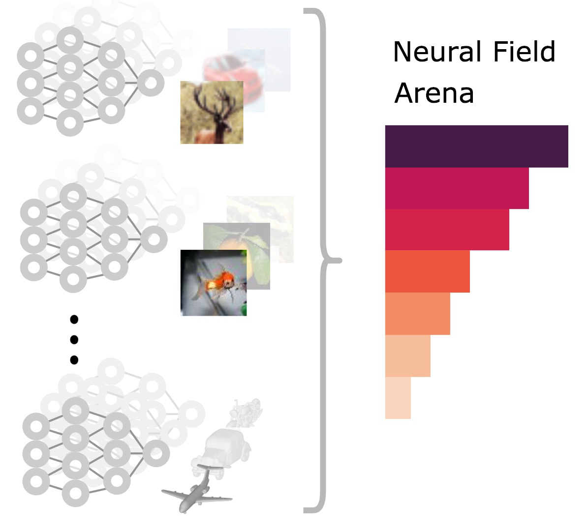

# 🖼️ **Neural Field Arena** - Neural datasets made easy

Creators: [Samuele Papa](https://samuelepapa.github.io), [Riccardo Valperga](https://twitter.com/RValperga), [Phillip Lippe](https://phlippe.github.io/) [David Knigge](https://twitter.com/davidmknigge).

[](https://opensource.org/licenses/MIT)
[](https://www.python.org/downloads/release/python-390/)
[](https://github.com/psf/black)


We provide a simple interface to load the neural datasets from the **Neural Field Arena**.

*Transformations* are also implemented in Jax, Pytorch and Numpy. They allow for geometric and network transformations, as well as permutation to be applied to the neural fields.

The neural fields have been stored in an efficient vectorized format, to allow for quick read and compact storage. The conversion from vectorized to list format, which most of the literature uses, is very straightforward and a specific transform is provided as part of the transformation package.

Soon this library will be available on PyPI.

## Download

To download the datasets, use this link: [https://doi.org/10.5281/zenodo.10392793](https://doi.org/10.5281/zenodo.10392793).

## Contributing

Please help us improve this repository by providing your own suggestions or bug report through this repository's issues system.
Before committing, please ensure to have `pre-commit` installed. This will ensure that the code is formatted correctly and that the tests pass. To install it, run:

```bash
pip install pre-commit
pre-commit install
```

## License

Distributed under the MIT License. See `LICENSE` for more information.

## Acknowledgements and Contributions

We thank Miltiadis Kofina, and David Romero for the feedback during development.
